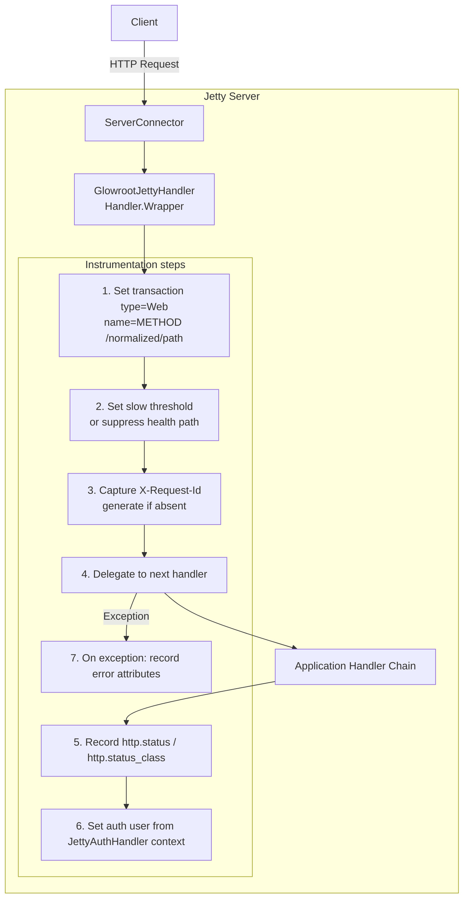
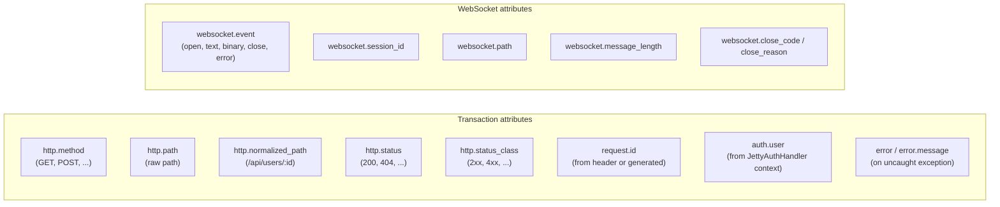

# ether-glowroot-jetty12

Glowroot APM instrumentation for ether HTTP and WebSocket applications running on Jetty 12. Provides transaction naming, path normalization, request-ID capture, authenticated-user recording, health-path suppression, per-route slow thresholds, and WebSocket lifecycle instrumentation — all without ever affecting production behaviour when the Glowroot agent is absent.

**All Glowroot calls are wrapped in `try/catch(Throwable)`** so a missing agent, a class-not-found, or any other agent-side error is silently swallowed and has zero impact on the application.

## Coordinates

```xml
<dependency>
    <groupId>dev.rafex.ether.glowroot</groupId>
    <artifactId>ether-glowroot-jetty12</artifactId>
    <version>8.0.0-SNAPSHOT</version>
</dependency>
```

All dependencies are declared `provided` scope — they must be present at compile time but are supplied by the deploying application at runtime:

```xml
<!-- Required in the application POM (provided by ether-glowroot-jetty12 at compile time) -->
<dependency>
    <groupId>org.glowroot</groupId>
    <artifactId>glowroot-agent-api</artifactId>
    <scope>provided</scope>
</dependency>
<dependency>
    <groupId>dev.rafex.ether.http</groupId>
    <artifactId>ether-http-core</artifactId>
</dependency>
<dependency>
    <groupId>dev.rafex.ether.http</groupId>
    <artifactId>ether-http-jetty12</artifactId>
</dependency>
<dependency>
    <groupId>dev.rafex.ether.observability</groupId>
    <artifactId>ether-observability-core</artifactId>
</dependency>
<dependency>
    <groupId>dev.rafex.ether.websocket</groupId>
    <artifactId>ether-websocket-core</artifactId>
</dependency>
<dependency>
    <groupId>org.eclipse.jetty</groupId>
    <artifactId>jetty-server</artifactId>
</dependency>
```

> **JVM agent argument required for Glowroot to function at runtime:**
> ```
> java -javaagent:/path/to/glowroot.jar -jar myapp.jar
> ```
> Without `-javaagent`, the `org.glowroot.agent.api.*` classes are absent. All Glowroot calls inside this library will throw `NoClassDefFoundError`, which is caught by the surrounding `try/catch(Throwable)` and silently ignored.

---

## Component overview

| Class | Role |
|---|---|
| `GlowrootJettyHandler` | Jetty `Handler.Wrapper` — the recommended all-in-one integration; wraps everything |
| `GlowrootHttpMiddleware` | ether `Middleware` — sets transaction type and name |
| `GlowrootStatusCapturingMiddleware` | ether `Middleware` — records HTTP status code |
| `GlowrootAuthUserMiddleware` | ether `Middleware` — records authenticated user |
| `GlowrootRequestIdMiddleware` | ether `Middleware` — records request ID |
| `GlowrootHealthExclusionMiddleware` | ether `Middleware` — suppresses slow alerts for probe paths |
| `GlowrootSlowThresholdMiddleware` | ether `Middleware` — per-route slow thresholds |
| `GlowrootWebSocketEndpointWrapper` | Decorator for `WebSocketEndpoint` — instruments WS lifecycle |
| `GlowrootJettyExtractors` | Factory for Jetty-specific extractor functions |
| `PathNormalizer` | Replaces UUIDs, ObjectIds, and numbers in paths with canonical placeholders |

---

## Architecture: request flow through GlowrootJettyHandler



---

## Glowroot attributes set per request



---

## PathNormalizer

`PathNormalizer.normalize(path)` replaces dynamic path segments with canonical placeholders so Glowroot can aggregate traces across all requests to the same logical endpoint:

| Input path | Normalized output |
|---|---|
| `/api/users/550e8400-e29b-41d4-a716-446655440000` | `/api/users/:id` |
| `/api/orders/507f1f77bcf86cd799439011` | `/api/orders/:id` |
| `/api/items/42` | `/api/items/:n` |
| `/api/items/1` | `/api/items/1` (single digits unchanged) |
| `//double//slash` | `/double/slash` |
| `null` or `""` | `"unknown"` |

Rules applied in order:

1. Collapse multiple slashes.
2. Replace UUID segments with `/:id`.
3. Replace 24-hex (MongoDB ObjectId) segments with `/:id`.
4. Replace numeric segments of 2+ digits with `/:n`.

---

## GlowrootJettyHandler — minimal setup

`GlowrootJettyHandler` is a Jetty `Handler.Wrapper`. Its `Builder.wrap(Handler)` method matches the `JettyMiddleware` functional interface, making registration a one-liner.

```java
package com.example;

import dev.rafex.ether.glowroot.jetty12.GlowrootJettyHandler;

public final class ServerBootstrap {

    public static void configure(/* JettyMiddleware registry or equivalent */ Object middlewares) {
        var glowroot = GlowrootJettyHandler.builder()
            .healthPath("/health")
            .healthPath("/ready")
            .requestIdHeader("X-Request-Id")
            .build();

        // Works with JettyMiddleware functional interface:
        // middlewareRegistry.add(glowroot::wrap);
    }
}
```

---

## GlowrootJettyHandler — full setup

```java
package com.example;

import dev.rafex.ether.glowroot.jetty12.GlowrootJettyHandler;
import dev.rafex.ether.observability.core.request.UuidRequestIdGenerator;

public final class GlowrootConfig {

    public static GlowrootJettyHandler.Builder builder() {
        return GlowrootJettyHandler.builder()
            // Health-check paths are never flagged as slow transactions
            .healthPaths("/health", "/ready", "/live", "/metrics")

            // Default slow threshold for all routes (ms)
            .defaultSlowThreshold(2_000)

            // Per-route overrides: export jobs are expected to take up to 30 s
            .slowThreshold("/api/export/:id", 30_000)
            // Auth endpoint should be fast
            .slowThreshold("/api/auth/login", 500)

            // Capture X-Request-Id from incoming request;
            // generate a UUID if the header is absent
            .requestIdHeader("X-Request-Id", true)

            // Extract the authenticated user from the JettyAuthHandler context
            // (the context is whatever was passed to TokenVerificationResult.ok(ctx))
            .userExtractor(ctx -> ctx instanceof MyAuthContext a ? a.subject() : null);
    }
}
```

Registration with a middleware registry (ether / Kiwi pattern):

```java
var builder = GlowrootConfig.builder();
middlewareRegistry.add(builder::wrap); // builder::wrap is a JettyMiddleware
```

---

## Custom userExtractor for JWT auth context

The `userExtractor` function receives the raw `Object` stored at `JettyAuthHandler.REQ_ATTR_AUTH` by the JWT verification handler. Cast to your auth context type:

```java
package com.example.auth;

import dev.rafex.ether.glowroot.jetty12.GlowrootJettyHandler;

public record AuthContext(String subject, String tenantId, String[] roles) {}

// In your server configuration:
var glowroot = GlowrootJettyHandler.builder()
    .userExtractor(ctx -> {
        if (ctx instanceof AuthContext auth) {
            // Glowroot will show this as the "user" in trace details
            return auth.subject();
        }
        return null; // unauthenticated requests — user not recorded
    })
    .build();
```

If the extractor throws for any reason, the exception is caught and the user field is simply not set — the request continues normally.

---

## ether-level middlewares (alternative to GlowrootJettyHandler)

When your application uses the ether `Middleware` chain (rather than Jetty `Handler.Wrapper` directly), use the individual middleware classes instead of `GlowrootJettyHandler`. Register them in this order:

```java
import dev.rafex.ether.glowroot.jetty12.*;

// 1. Transaction naming (must be first)
middlewareRegistry.add(new GlowrootHttpMiddleware());

// 2. Status code capture
middlewareRegistry.add(new GlowrootStatusCapturingMiddleware());

// 3. Health path suppression
middlewareRegistry.add(GlowrootHealthExclusionMiddleware.defaults());
// or custom paths:
middlewareRegistry.add(GlowrootHealthExclusionMiddleware.of("/ping", "/status"));

// 4. Per-route slow thresholds
middlewareRegistry.add(
    GlowrootSlowThresholdMiddleware.builder()
        .defaultThreshold(2_000)
        .threshold("/api/export/:id", 30_000)
        .threshold("/api/auth/login", 500)
        .build()
);

// 5. Request ID from X-Request-Id header (generate UUID if absent)
middlewareRegistry.add(new GlowrootRequestIdMiddleware(
    GlowrootJettyExtractors.xRequestId(), true
));

// 6. Authenticated user (requires JettyAuthHandler earlier in the chain)
middlewareRegistry.add(new GlowrootAuthUserMiddleware(
    GlowrootJettyExtractors.authUser()
));
```

### GlowrootJettyExtractors

`GlowrootJettyExtractors` provides pre-built extractor functions for common Jetty use cases. All extractors safely return `null` when the exchange is not a `JettyHttpExchange` (e.g. in unit tests):

```java
// Read the authenticated user set by JettyAuthHandler
Function<HttpExchange, String> user = GlowrootJettyExtractors.authUser();

// Read X-Request-Id header
Function<HttpExchange, String> reqId = GlowrootJettyExtractors.xRequestId();

// Read any custom header
Function<HttpExchange, String> correlation =
    GlowrootJettyExtractors.header("X-Correlation-Id");

// Client IP (prefers X-Forwarded-For, falls back to socket address)
Function<HttpExchange, String> ip = GlowrootJettyExtractors.clientIp();
```

---

## Instrument WebSocket endpoints

Wrap any `WebSocketEndpoint` with `GlowrootWebSocketEndpointWrapper` before registering it:

```java
import dev.rafex.ether.glowroot.jetty12.GlowrootWebSocketEndpointWrapper;
import dev.rafex.ether.websocket.jetty12.JettyWebSocketRouteRegistry;

JettyWebSocketRouteRegistry registry = new JettyWebSocketRouteRegistry();

registry.add("/ws/chat/{room}",
    new GlowrootWebSocketEndpointWrapper(new ChatRoomEndpoint()));

registry.add("/ws/echo",
    new GlowrootWebSocketEndpointWrapper(new EchoEndpoint()));
```

Each lifecycle callback sets a Glowroot transaction of type `"WebSocket"` named `"EVENT /path"`:

| Callback | Transaction name | Additional attributes |
|---|---|---|
| `onOpen` | `OPEN /ws/chat/{room}` | `websocket.event=open` |
| `onText` | `TEXT /ws/chat/{room}` | `websocket.event=text`, `websocket.message_length` |
| `onBinary` | `BINARY /ws/chat/{room}` | `websocket.event=binary`, `websocket.message_length` |
| `onClose` | `CLOSE /ws/chat/{room}` | `websocket.event=close`, `websocket.close_code`, `websocket.close_reason` |
| `onError` | `ERROR /ws/chat/{room}` | `websocket.event=error`, `error`, `error.message` |

All callbacks also set `websocket.session_id` and `websocket.path`.

---

## GlowrootHealthExclusionMiddleware — defaults

The default path set suppressed from slow-transaction alerts:

```java
GlowrootHealthExclusionMiddleware.DEFAULT_PATHS
// => {"/health", "/ready", "/live", "/metrics"}
```

These paths are still recorded normally by Glowroot — only the slow-threshold flag is raised to `Long.MAX_VALUE` so they never appear in the slow-traces list.

---

## GlowrootSlowThresholdMiddleware — fluent builder

```java
var thresholds = GlowrootSlowThresholdMiddleware.builder()
    .defaultThreshold(2_000)         // 2 s for everything not listed
    .threshold("/api/export/:id", 30_000)  // export endpoint: 30 s
    .threshold("/api/report/:id", 60_000) // report: 60 s
    .threshold("/api/auth/token",   500)   // auth: 500 ms
    .build();

middlewareRegistry.add(thresholds);
```

Path matching uses `PathNormalizer.normalize()` so the pattern `/api/export/:id` matches any concrete URL like `/api/export/550e8400-...` or `/api/export/99`.

---

## Complete server bootstrap example

```java
package com.example;

import dev.rafex.ether.glowroot.jetty12.*;
import dev.rafex.ether.websocket.core.WebSocketRoute;
import dev.rafex.ether.websocket.jetty12.*;

public final class ProductionServer {

    public static void main(String[] args) throws Exception {
        // --- Glowroot handler (HTTP) ---
        var glowrootBuilder = GlowrootJettyHandler.builder()
            .healthPaths("/health", "/ready")
            .defaultSlowThreshold(2_000)
            .slowThreshold("/api/export/:id", 30_000)
            .requestIdHeader("X-Request-Id", true)
            .userExtractor(ctx -> ctx instanceof AuthContext a ? a.subject() : null);

        // --- WebSocket server with instrumented endpoints ---
        var chatEndpoint      = new ChatRoomEndpoint();
        var wrappedChat       = new GlowrootWebSocketEndpointWrapper(chatEndpoint);

        var registry = new JettyWebSocketRouteRegistry();
        registry.add("/ws/chat/{room}", wrappedChat);
        registry.add("/ws/echo",        new GlowrootWebSocketEndpointWrapper(new EchoEndpoint()));

        var config = JettyWebSocketServerConfig.fromEnv();
        var runner = JettyWebSocketServerFactory.create(config, registry);

        // Attach the Glowroot handler as the outermost wrapper
        var jettyServer = runner.server();
        var appHandler  = jettyServer.getHandler();
        jettyServer.setHandler(glowrootBuilder.wrap(appHandler));

        runner.start();
        System.out.println("Server started on port " + config.port());
        runner.join();
    }
}
```

---

## Safety guarantees

Every Glowroot call in this library follows the same pattern:

```java
try {
    Glowroot.setTransactionType("Web");
    Glowroot.setTransactionName(method + " " + normalized);
} catch (Throwable ignore) {
    // Agent absent, class not found, or any other agent error.
    // Silently swallowed — the request continues normally.
}
```

This means:

- Adding this library to a project that does **not** run the Glowroot agent has zero effect.
- A Glowroot agent upgrade or downgrade that breaks binary compatibility does not crash the application.
- Health checks, WebSocket connections, and normal HTTP traffic are never delayed or interrupted by instrumentation failures.

---

## License

MIT License — Copyright (c) 2025–2026 Raúl Eduardo González Argote
